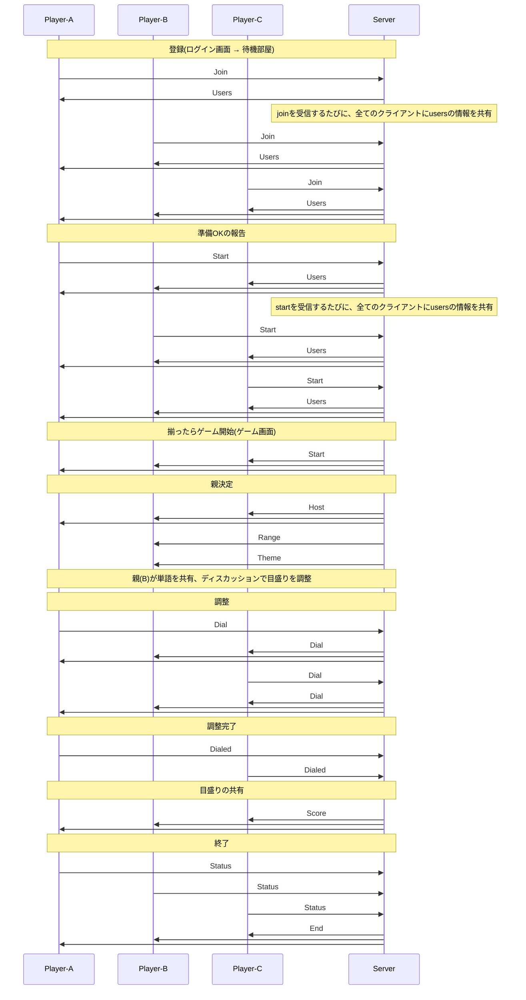

# wavelength api
WebSocketを使い、クライアント・サーバ間で情報の共有を行う。  

## base
- websocket sample(JS)
  ```
  var ws = await newWebSocket("wss://echo.websocket.org")
  ws.addEventListener('message', (e) => { console.log("received: " + e.data); });

  var query = {
    "type": "join",
    "name": "B"
  };
  ws.send(JSON.stringify(query));
  ```

- websocket sample(Nim on client)
  ```
  ???
  ```


## send
クライアント→サーバ

### Join
ユーザの登録

| key | value | required | comment |
|--|--|--|--|
| type | "Join" | Y | identifier of 'Join' |
| name | string | Y | user's name |

example
```
{
  "type": "Join",
  "name": "Bob"
}
```

### Id
自身のIDをリクエスト
| key | value | required | comment |
|--|--|--|--|
| type | "Id" | Y | identifier of 'Id' |

### Status
ユーザのステータスを共有  
- Standby: 準備中  
- Active: ゲーム開始可能  

| key | value | required | comment |
|--|--|--|--|
| type | "Status" | Y | identifier of 'Status' |
| status | Standby \| Active | N | user's status (default is standby) |


### Dial
ダイアルの値を調節

| key | value | required | comment |
|--|--|--|--|
| type | "Dial" | Y | identifier of 'Dial' |
| value | int[1..100] | Y | value of dial |

### Dialed
調整完了

| key | value | required | comment |
|--|--|--|--|
| type | "Dialed" | Y | identifier of 'Dialed' |


## receive
サーバ→クライアント

### Id
ユーザのIdを共有
| key | value | required | comment |
|--|--|--|--|
| type | "Id" | Y | identifier of 'Id' |
| id | string | Y | user's Id |


### Users
現在接続しているプレイヤーをクライアントに共有
| key | value | required | comment |
|--|--|--|--|
| type | "Users" | Y | identifier of 'Users' |
| users | [{...}, {...}, ...] | Y | current users |
| users.name | string | Y | users name (including myself) |
| users.status | Standby \| Active | Y | status<br>- standby: 待機中<br>- active: 準備OK |
| users.id | string | Y | identifier of user |

example
```
{
  "type": "Users",
  "users": [
    {
      "name": "A",
      "status": "Active",
      "id": "xO6wR/R8GtlVr/C40qcQbg=="
    },
    {
      "name": "B",
      "status": "Standby",
      "id": "y23lp/asdFRRR/asoidnuI=="
    }
  ]
}
```

### Host
Host(親)を割り振り
| key | value | required | comment |
|--|--|--|--|
| type | "Host" | Y | identifier of 'Host' |
| user | string | Y | host's name |

### Range
hostにターゲットの範囲([下限, 上限])を共有

| key | value | required | comment |
|--|--|--|--|
| type | "Range" | Y | identifier of 'Range' |
| "1" | [int, int] | Y | range of '1' points |
| "2" | [int, int] | Y | range of '2' points |
| "3" | [int, int] | Y | range of '3' points |
| "4" | [int, int] | Y | range of '4' points |

example
```
{
  "type": "Range",
  "1": [0, 35],
  "2": [5, 30],
  "3": [10, 25],
  "4": [15, 20]
}
```

### Theme
hostにお題を共有

| key | value | required | comment |
|--|--|--|--|
| type | "Theme" | Y | identifier of 'Theme' |
| theme1 | string | Y | theme 1 |
| theme2 | string | Y | theme 2 |

### Dial
dialの変更を共有

| key | value | required | comment |
|--|--|--|--|
| type | "Dial" | Y | identifier of 'Dial' |
| value | int | Y | current dial num. |

### Score
結果発表

| key | value | required | comment |
|--|--|--|--|
| type | "Score" | Y | identifier of 'Score' |
| range | {} | Y | range |
| range."1" | [int, int] | Y | range of '1' points |
| range."2" | [int, int] | Y | range of '2' points |
| range."3" | [int, int] | Y | range of '3' points |
| range."4" | [int, int] | Y | range of '4' points |
| dial | {} | Y | dial |
| dial.value | int[1..100] | Y | dial num result |

example
```
{
  "type": "Score"
  "range": {
    "1": [0, 35],
    "2": [5, 30],
    "3": [10, 25],
    "4": [15, 20]
  },
  "dial": {
    "value": 18
  }
}
```

### End
ゲーム終了の合図

| key | value | required | comment |
|--|--|--|--|
| type | "End" | Y | identifier of 'End' |


# ゲーム進行


